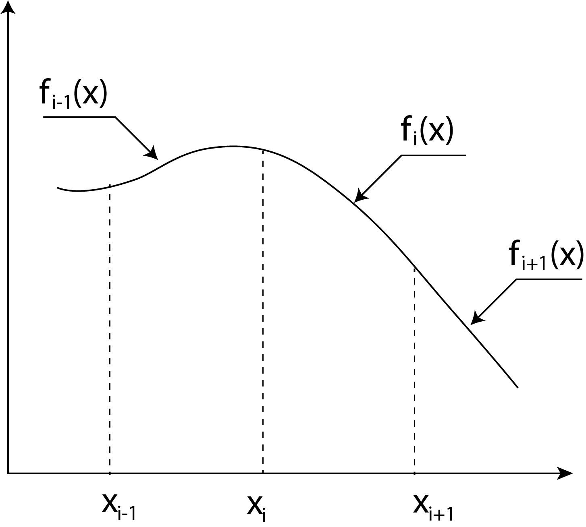

<h3>Introduction</h3>

The methods, previously discussed, fit a single function (f(x)) amongst the given data points. This function is then used for interpolation. The procedure used becomes tedious when the number of data points is very large. In such cases, a recently developed method is used. It is known as Spline interpolation.

In this method, some polynomial is fitted between two consecutive datapoints. Thus, the entire function for given set of datapoints consists of number of segments of curves. Each segment of curve is known as Spline.

<h3>Definition :</h3>

&emsp; Spline is a segment of curve (respective to a polynomial) fitted between two consecutive data points.  
&emsp; According to the polynomial used, a spline is referred as linear spline, quadratic spline, cubic spline etc.

 

Fig. shows spline interpolation. Different functions f1, f2, etc. are obtained for successive pairs of data points by assuming a polynomial. Assuming these functions to be linear (i.e. straight line segments) it can be noticed that, the function values of both fiunctions meeting at any datapoints are same.

$$ \begin{aligned}
   i.e. \ at \qquad &x = x_2\ \ we\ get\ f_1(x_2) = f_2(x_2) \\
   at \qquad &x = x_3 \ \ we\ get\ f_2(x_3) = f_3(x_3)\ etc.  
\end{aligned} $$

For better interpolation, the splines must satisfy following three conditions at each junction point (i.e. datapoint);

<ol type="1">
   <li>
      <strong>Continuity condition :</strong> It implies that, the values of both functions meeting at junction (i.e. data point) should be same.
   </li>
   <li><strong>Tangency condition :</strong> It implies that, the tangent drawn to both the curves at the junction should have same slope.</li>
   <li><strong>Curvature condition :</strong> It implies that, the curvature of both functions (i.e. rate of change of slope) at the junction point should be same.</li>
</ol>

A linear spline (a curve for polynomial of degtee one) can satisfy only first condition.  
 A quadratic spline (a curve for polynomial of degree two) can satisfy first two conditions. 
  While a CUBIC SPLINE (a curve for polynomial of degree three) can satisfy all the three conditions. Hence in practice interpolation is performed using a cubic spline.

<h3>Derivation :</h3>

The equation of cubic spline which lies between (xi, yi) and (xi+1, yi+1) is as below

$$ f_i(x) = a_i(x-x_i)^3 + b_i(x-x_i)^2 + c_i(x-x_i) + d_i \qquad \qquad ... equ(1) $$

We have n + 1 data points so we have fi(x) for i= 1 to n. The conditions to meet are

<ol type="1">
   <li>Continuity in the curve</li>
   <li>Tangency continuity</li>
   <li>Curvature continuity</li>
</ol>

<h3>1. Continuity in the curve</h3>

$$ \begin{aligned}
   &f_i(x_i) = y_i \ for \ i=1\ to\ n \qquad \qquad &...equ(2) \\
   &f_i(x_{i+1}) = f_{i +1}(x_{i+1}) \ for\ i=1 \ to \ n-1 \qquad \qquad &...equ(3)
\end{aligned}
$$

<h3>2. Tangency continuity </h3>

$$
   f_i^{'}(x_{i+1}) = f_{i+1}^{'}(x_{i+1}) \ for \ i=1 \ to\ n \qquad \qquad ...equ(4)
$$

<h3>3. Curvature continuity </h3>

$$ 
   f_i^{''}(x_{i+1}) = f_{i+1}^{''}(x_{i+1}) \ for \ i = 1 \ to \ n  \qquad \qquad ...equ(5)
$$

 

Now using equation (2) in (1) we get

$$ f_i(x_i) = a_i(x_i-x_i)^3 + b_i(x_i - x_i)^2 + c_i(x_i-x_i) + d_i = y_i $$

$$ ∴ \qquad d_i = y_i \quad i=1 \ to \ n \qquad \qquad ...equ(6) $$

 

Similarly using equation (3) in (1) we get

$$
   \begin{aligned}
      y_{i+1} &= a_i(x_{i+1} - x_i)^3 + b_i(x_{i+1} - x_i)^2 + c_i(x_{i+1} - x_i) \\
      &=a_ih_i^3 + b_ih_i^2 + c_ih_i + y_i
   \end{aligned}
$$

$$
For \qquad i=1 \ to \ n \qquad \qquad ...equ(7)
$$

$$
h_i = (x_{i+1} - x_i) \ width \ of\ the\ internal
$$

Now for tangency and curvature continuity are diffentiate equation (1)

$$
\begin{aligned}
   f_i^{'}(x) &= 3a_i(x-x_i)^2 + 2b_i(x-x_i) + c_i \qquad \qquad &...equ(8) \\

f_i^{''}(x) &= 6a_i (x-x_i)+ 2b_i \qquad \qquad &...equ(9) \\ 

For \qquad i&=1 \ to \ n \\ 

Let's \ put \ f_i^{''}(x) &= S_i \ \ for \ i=1\ to \ n \\
∴ \qquad at  \ x &= x_i \\
S_i &= 6a_i(x_i-x_i) + 2b_i = 2b_i \\
∴ \qquad b_i &= \frac{S_i}{2} \qquad \qquad &...equ(10) \\
at \qquad x &= x_{i+1} \\
S_{i+1} &= 6a_i(x_{i+1} - x_i) +2b_i = 6a_ih_i + 2b_i \\
or \qquad a_i &= \frac{S_{i+1}-S_i}{6h_i} \qquad \qquad &...equ(11) \\
∵ \qquad b_i &= \frac{S_i}{2}
\end{aligned}
$$

Now put ai, bi and di into equation (1) and solving for ci

$$ \begin{aligned}
   y_{i+1} &= \left(\frac{S_{i+1}-S_i}{6h_i}\right)h_i^3 + \frac{S_i}{2}h_i^2 + c_ih_i + y_i \\
   c_i &= \frac{y_{i+1} - y_i}{h_i} - \frac{2h_iS_i + h_iS_{i+1}}{6} \qquad \qquad ...equ(12)
\end{aligned} $$

Now we use tangency continuity equation (4) at × = xi between interval xi and xi+1 from equation (8)

$$
   f_i^{'}(x_i) = y_i^{'} = 3a_i(x_i - x_i)^2 + 2b_i(x_i - x_i) + c_i = c_i \qquad \qquad ...equ(13)
$$

Similarly slope between xi-1 to xi at x = xi

$$
\begin{aligned}
   y_i^{'} &= 3a_{i-1}(x_i -x_{i-1}) + 2b_i(x_i-x_{i-1}) + c_{i-1} \\
   &= 3a_{i-1}h_{i-1}^2 + 2b_{i-1} + c_{i-1} \qquad \qquad ...equ(14)
\end{aligned}
$$

Equation (13) abd (14)

$$ c_i = 3a_{i-1}h_{i-1}^2+2b_{i-1}h_{i-1}+c_{i-1} $$

Now using ci, bi, ai and di in above equaiton we get

$$
3\left(\frac{S_i - S_{i-1}}{6h_{i-1}}\right)h_{i-1}^2 + 2\left(\frac{S_{i-1}}{2}\right)h_{i-1}+\frac{y_i-y_{i-1}}{h_{i-1}} - \frac{2h_{i-1}S_{i-1}+h_{i-1}S_i}{6}  = \frac{y_{i+1}-y_i}{h_i}-\frac{2h_iS_i+h_iS_{i+1}}{6}
$$

 

Rearranging the equation we get

$$
h_{i-1}S_{i-1}+(2h_{i-1} + 2h_i)S_i+h_iS_{i+1} = 6\left(\frac{y_{i+1}-y_i}{h_i} - \frac{y_i - y_{i-1}}{h_{i-1}}\right) = f(x_{i+1}, x_i, x_{i-1}) \qquad \qquad ...equ(15)
$$

where i = 2 so that in equaiton (15) first value Si-1 will be S1 and last values of

$$ S_{i+1} = S_{n+1} \ \ at \ \ i = n $$

So i varies from i=2 to n and we have n-1 number of equation.

Si (i=1 to n+1) that is Si varies from S1 to Sn+1 because of this we have n+1 unknowns with n-1 equation.

 

&emsp; Now assuming end cubies appraches to linearity  
&emsp; i.e. natural spline we get S1 and Sn+1 = 0.  
&emsp; Now n-1 unknows can be solve with n-1 equation.

From equation (15) i=2 to n

$$ \begin{bmatrix}
   2(h_1 + h_2) & h_2 & & \\
   h_2 & 2(h_2+h_3) & h_3 & \\
   & h_3 & 2(h_3+h_4) & h_4 \\
   & & & \vdots
\end{bmatrix} 
× 
\begin{bmatrix}
   S_1 \\ S_2 \\ S_3 \\ \vdots
\end{bmatrix}
=
\begin{bmatrix}
   f(x_3, x_2, x_1) \\
   f(x_4, x_3, x_2) \\
   f(x_5, x_4, x_3) \\
   \vdots
\end{bmatrix}
$$

 

where (S1= 0 and Sn+1 = 0)

The above system can be solve with the help of TDMA to get values of S and in turn ai, bi, ci and di
